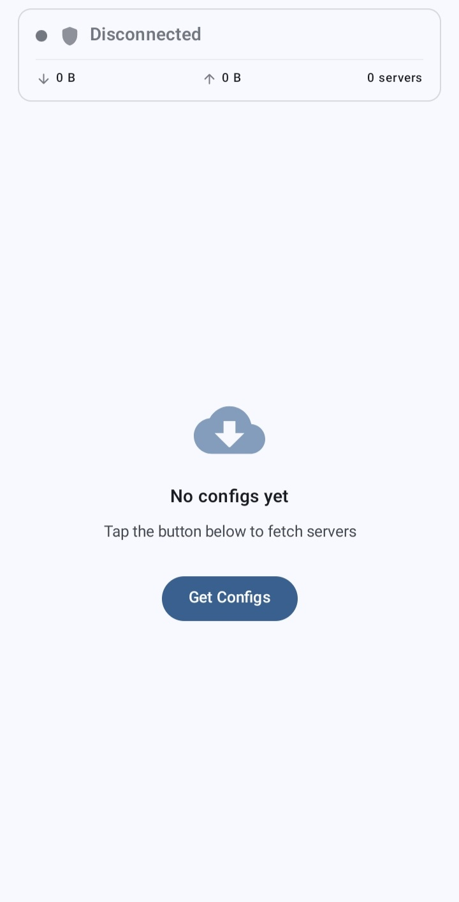
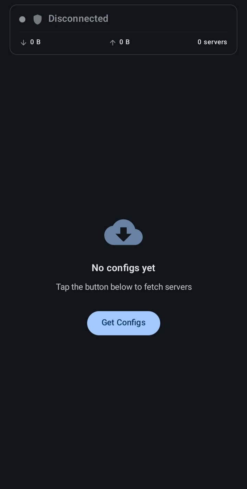
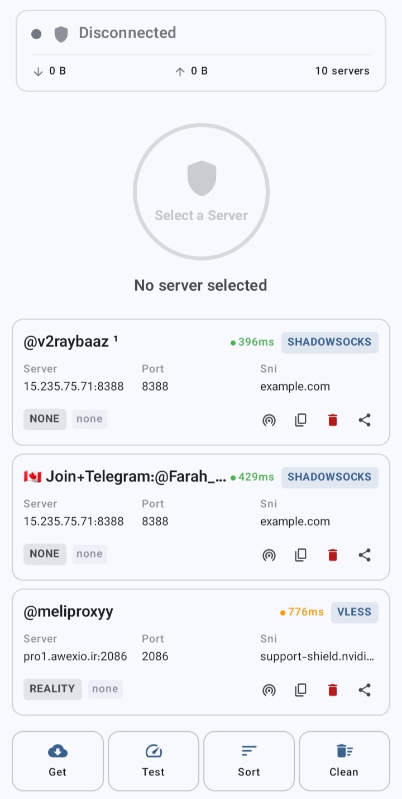
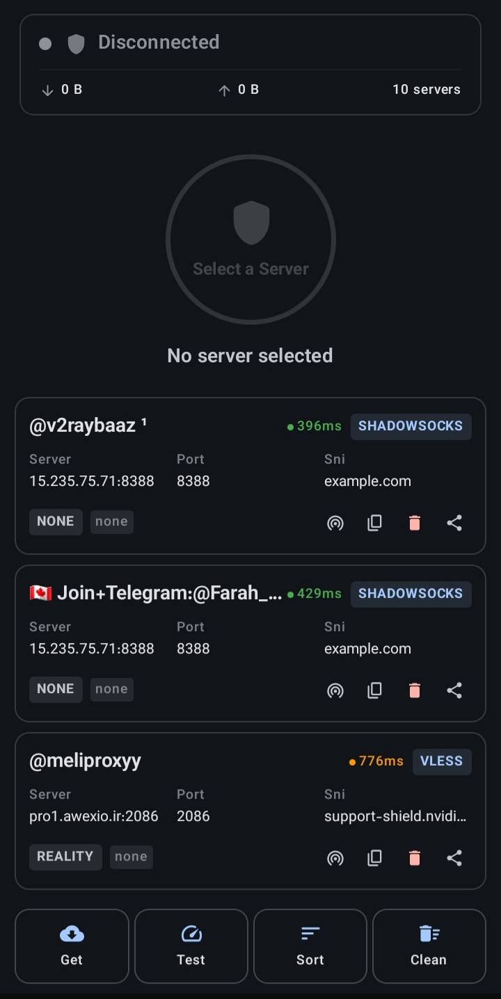
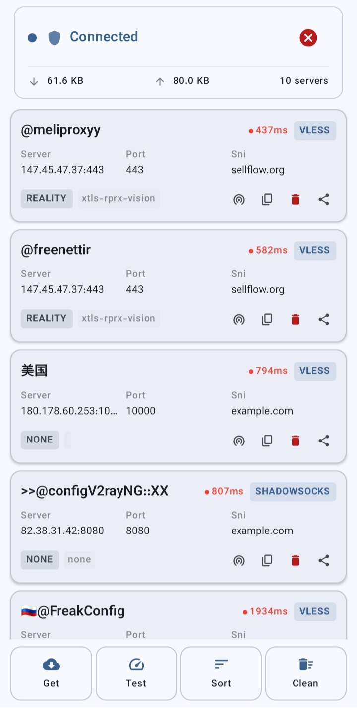
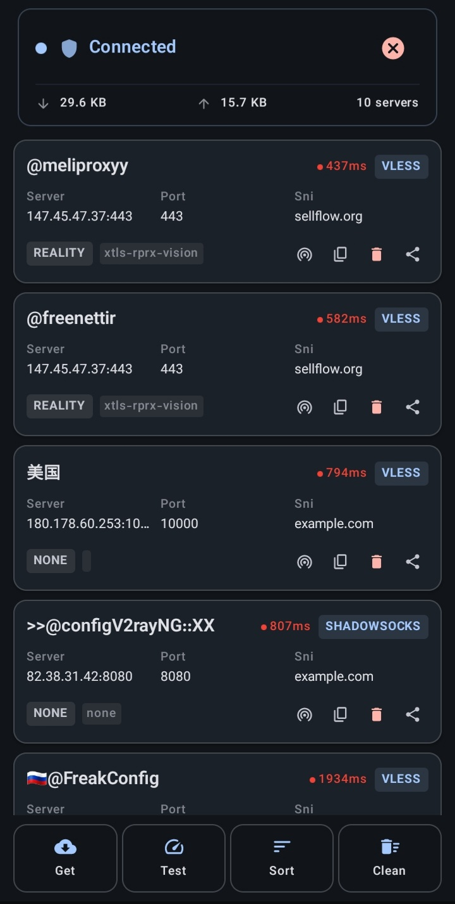

<div align="center">

# ⚡ VegaNG

**یک کلاینت VPN سریع و سبک برای اندروید**

وی‌گا‌ان‌جی یک اپلیکیشن VPN مدرن و پرسرعت است که از هسته V2Ray برای ارتباطی سریع و مطمئن استفاده می‌کند.

[](https://www.android.com)
[](https://kotlinlang.org)
[](https://developer.android.com)
[](LICENSE)

[**English**](README.md)

</div>

---

## ✨ امکانات

| ⚡ عملکرد | 🎨 طراحی |
|:---------------|:----------|
| 🕐 تست پینگ تکی و گروهی | 🎯 متریال ۳ با جت‌پک کامپوز |
| 📊 مرتب‌سازی خودکار بر اساس کمترین پینگ | 🌍 دوزبانه فارسی و انگلیسی (RTL) |
| 🗑️ پاکسازی یک‌کلیکی کانفیگ‌های ازکارافتاده | 🚀 طراحی تمیز برای حالت خالی |
| 🔒 هسته پایدار و امن V2Ray | 🌓 پشتیبانی از تم روشن و تیره |

---

## 🖼️ اسکرین‌شات‌ها

<p align="center">
  
  
  
  
  
  
</p>

---

## 📥 نصب

آخرین نسخه APK را از [Releases](https://github.com/KianMahmoudi/VegaNG/releases) دانلود کنید.

> **نکته:** از آنجا که برنامه در گوگل‌پلی منتشر نشده، اندروید هشدار «نصب از منابع ناشناس» نمایش می‌دهد. کافی است برای این نصب آن را مجاز کنید.

---

## 🚀 شروع سریع

```
1. Get   ← دریافت کانفیگ‌ها از سرور
2. Test  ← اندازه‌گیری پینگ همه کانفیگ‌ها
3. Sort  ← سریع‌ترین سرورها در بالا
4. Clean ← حذف کانفیگ‌های ازکارافتاده
5. کلیک روی یک کانفیگ ← اتصال
```

---

## 🛠️ ساخت از سورس

**پیش‌نیازها:** اندروید استودیو · JDK 17+ · Android SDK 35

```bash
git clone https://github.com/KianMahmoudi/VegaNG.git
./gradlew assembleDebug
./gradlew assembleRelease
```

خروجی APK:

```
app/build/outputs/apk/{debug,release}/app-{debug,release}.apk
```

---

## 🏗️ معماری

ساخته‌شده با معماری تمیز **MVVM**:

```
┌───────────────────────────────────┐
│            لایه رابط کاربری       │
│   Jetpack Compose · Material 3    │
├───────────────────────────────────┤
│          ViewModel (Hilt)         │
│   state · events · coroutines     │
├───────────────────────────────────┤
│           Repository              │
│   ConfigRepository · VpnRepository │
├───────────────────────────────────┤
│            لایه داده              │
│   Room DB · Config Parser         │
├───────────────────────────────────┤
│            هسته VPN               │
│      libv2ray · tun2socks         │
└───────────────────────────────────┘
```

---

## تکنولوژی‌ها

- **زبان:** کاتلین
- **رابط کاربری:** جت‌پک کامپوز + متریال ۳
- **معماری:** MVVM + الگوی Repository
- **تزریق وابستگی:** Hilt
- **دیتابیس:** Room
- **هسته VPN:** libv2ray + tun2socks
- **آسنکرون:** Coroutines + Flow